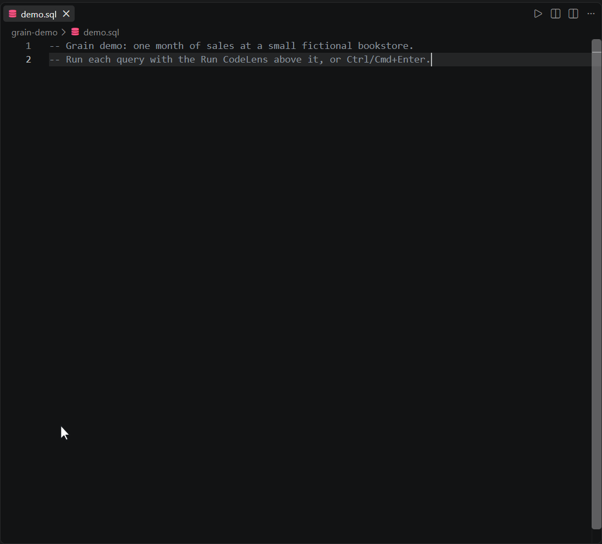
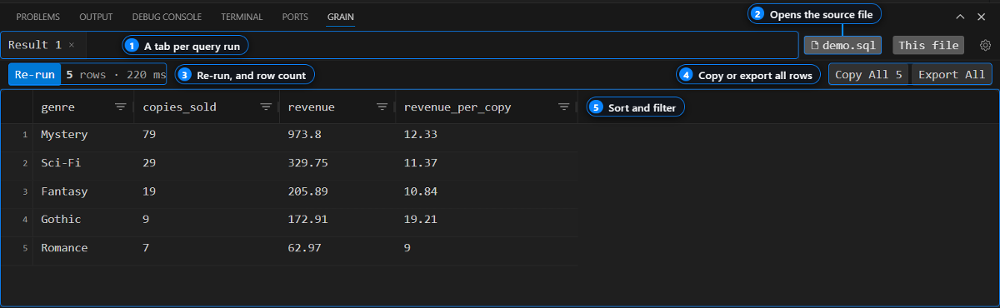

# Grain

**A fast SQL workspace for VS Code, and for the AI agents you work with.**

[Docs](https://grain.tools/docs) · [Changelog](CHANGELOG.md) · [Report a bug](https://github.com/pattrnlabs/grain/issues/new?template=01-bug-report.yml) · [Ask a question](https://github.com/pattrnlabs/grain/issues/new?template=04-question.yml)

Run SQL from any `.sql` file with `Ctrl+Enter` and get the results in a
sortable grid inside VS Code. Passwords stay in your OS keychain, and Grain
has no hosted service.

## Quick start

1. Install Grain from the
   [VS Code Marketplace](https://marketplace.visualstudio.com/items?itemName=pattrnlabs.grain)
   or [Open VSX](https://open-vsx.org/extension/pattrnlabs/grain) (for Cursor,
   Windsurf, and VSCodium).
2. Open a folder in VS Code. Grain adds its demo files there.
3. Open the **Grain** panel and click **Try the Demo**.
4. Put your cursor in any query in the file that opens and press `Ctrl+Enter`
   (`Cmd+Enter` on macOS).

The demo reads two CSV files through Grain's built-in DuckDB connection, so
there's nothing to set up. To query your own database, run
**Grain: Manage Connections**, add a profile, and test it before you save.

If Grain is useful to you, a star on this repo helps other developers find it.

## Use Grain from an AI agent

Grain can serve your database connections to Claude Code, Cursor, and GitHub
Copilot over MCP. Agents get read-only access by default, and every query an
agent runs shows up in your Grain results panel, so you can see exactly what
it did.

MCP is off until you turn on `grain.mcpEnabled` in settings. Setup steps for
each client are in the [MCP docs](https://grain.tools/docs/mcp), and example
prompts are in [`examples/agents/`](examples/agents/).

## Features

| Feature | What it does |
| --- | --- |
| Run from the editor | `Ctrl+Enter` runs the file; **Run Query Under Cursor** runs one statement; **Run Query in New Tab** keeps the previous result |
| Non-blocking queries | Queries run in a background process, so a slow query doesn't freeze VS Code |
| Connection manager | Create, test, and switch database profiles without editing JSON |
| Result grid | Sort, filter, and resize columns, see each column's SQL type, copy a selection as TSV |
| Full export | The grid shows the first 500 rows; export re-runs the query and writes every row to CSV, TSV, or JSON |
| Agent access over MCP | Claude Code, Cursor, and Copilot can query your connections; their results land in your panel |
| Remote setups | Works over WSL, dev containers, GitHub Codespaces, and Remote - SSH |

## Supported databases

<table>
  <tr>
    <th align="left">Relational databases</th>
    <td align="center" width="110"> PostgreSQL</td>
    <td align="center" width="110"> MySQL</td>
    <td align="center" width="110"> SQL Server</td>
    <td align="center" width="110"> SQLite</td>
  </tr>
  <tr>
    <th align="left">Data warehouses</th>
    <td align="center"> Snowflake</td>
    <td align="center"> BigQuery</td>
    <td></td>
    <td></td>
  </tr>
  <tr>
    <th align="left">Query engines &amp; lakehouses</th>
    <td align="center"> Trino / Presto</td>
    <td align="center"> DuckDB</td>
    <td></td>
    <td></td>
  </tr>
  <tr>
    <th align="left">Search</th>
    <td align="center"> Elasticsearch</td>
    <td></td>
    <td></td>
    <td></td>
  </tr>
</table>

Through Trino or Presto you can query your cluster's Iceberg, Delta Lake, and Hive tables.
DuckDB queries local CSV and Parquet files directly.

PostgreSQL and Trino / Presto are bundled with the extension. The others load
their driver on first use, and if a driver is missing, Grain tells you what to
install.

Need another database? [Request a connector](https://github.com/pattrnlabs/grain/issues/new?template=03-connector-request.yml).
Requests with the most 👍 get built first.

## Examples

Runnable queries for [Postgres](examples/postgres/), [MySQL](examples/mysql/),
[Elasticsearch](examples/elasticsearch/), and [DuckDB](examples/duckdb/), plus
[agent prompts](examples/agents/). Open any `.sql` file with Grain installed
and press `Ctrl+Enter`.

## Privacy

- **Your SQL, results, and passwords stay on your machine.** Passwords are
  stored in VS Code Secret Storage, backed by your OS keychain, and never in a
  settings file.
- **Agents are read-only by default.** With `grain.mcpSafeMode` on (the
  default), agents can only run `SELECT`, `SHOW`, `DESCRIBE`, `EXPLAIN`, `WITH`,
  and metadata queries. Agents can't read stored passwords or change saved
  connections.
- **Telemetry is anonymous.** Grain sends usage data that never includes SQL,
  results, credentials, hostnames, or schema names. Turn it off with
  `grain.telemetry.enabled`.

## FAQ

**Is Grain open source?**\
No. Grain is closed-source. This repo holds the issue tracker, docs, and
examples.

**Which databases does it support?**\
The nine listed [above](#supported-databases). To ask for another one,
[request a connector](https://github.com/pattrnlabs/grain/issues/new?template=03-connector-request.yml).

**Do my queries or passwords leave my machine?**\
No. There's no Grain server. Queries go straight from VS Code to your database,
and passwords stay in your OS keychain. See [Privacy](#privacy) for what the
anonymous telemetry does and doesn't include.

**How do I connect Claude Code or Cursor?**\
Turn on `grain.mcpEnabled`, then follow the steps for your client in the
[MCP docs](https://grain.tools/docs/mcp).

**Why does my database show a driver error?**\
Some connectors load their driver on first use. The error message names what
to install. If it's still failing after that,
[file a bug report](https://github.com/pattrnlabs/grain/issues/new?template=01-bug-report.yml)
with the Output panel logs (**View → Output → Grain**).

## Getting help

- **Bug:** [file a bug report](https://github.com/pattrnlabs/grain/issues/new?template=01-bug-report.yml)
- **Feature idea:** [file a feature request](https://github.com/pattrnlabs/grain/issues/new?template=02-feature-request.yml)
- **New database:** [request a connector](https://github.com/pattrnlabs/grain/issues/new?template=03-connector-request.yml)
- **Question:** check the [FAQ](#faq) and [docs](https://grain.tools/docs), then [ask a question](https://github.com/pattrnlabs/grain/issues/new?template=04-question.yml)

We don't have a fixed roadmap yet. What we build next depends a lot on what
people ask for here, especially connector requests. See
[CONTRIBUTING.md](CONTRIBUTING.md) for how to file a good issue.

## Star History 

## License

Grain is closed-source. See [LICENSE](LICENSE).
